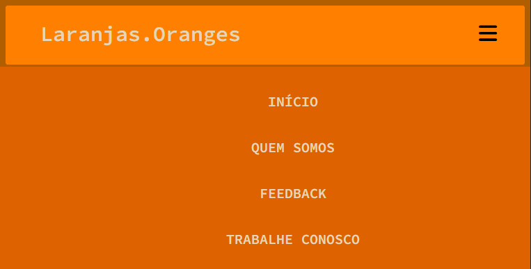

# Menu Hambúrger :hamburger:

### O Menu Hambúrger é conhecido no mundo do desenvolvimento através das 3 listras que geralmente ficam localizadas no canto esquerdo ou no canto direito do *header* da página.

### A origem do nome Menu Hambúrger é intuitiva: se temos um Hambúrger em nossa frente, ele é compacto e nem sempre podemos ver todos os ingredientes que o compõem. Mas caso nós abríssemos o alimento, e separarássemos cada um dos ingredientes, veríamos que o Hambúrger possui muito mais ingredientes do que aquilo que estamos acostumados a ver. 
### O projeto tem propriedades simples, utilizando apenas *Media Query*, uma técnica de resposividade para o CSS3.
